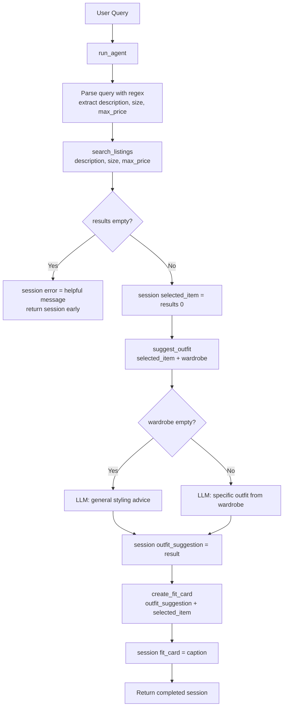

# FitFindr — planning.md

> Complete this document before writing any implementation code.
> Your spec and agent diagram are what you'll use to direct AI tools (Claude, Copilot, etc.) to generate your implementation — the more specific they are, the more useful the generated code will be.
> Your planning.md will be reviewed as part of your submission.
> Update it before starting any stretch features.

---

## Tools

List every tool your agent will use. For each tool, fill in all four fields.
You must have at least 3 tools. The three required tools are listed — add any additional tools below them.

### Tool 1: search_listings

**What it does:**
Searches the mock listings dataset using keywords from the user's description and optional size/price filters. Returns a ranked list of matching items, sorted by how many keywords from the description appear in the listing's title, description, category, style tags, colors, or brand.

**Input parameters:**
- `description` (str): Keywords describing what the user is looking for (e.g., "vintage graphic tee"). Used to score listings by keyword overlap.
- `size` (str | None): Clothing size to filter by (e.g., "M", "XL"). If None, no size filtering is applied. Matching is done by checking whether the provided size appears as a component of the listing's size field (e.g., "M" matches "S/M").
- `max_price` (float | None): Maximum price in USD, inclusive. If None, no price filtering is applied.

**What it returns:**
A list of listing dictionaries, sorted by relevance score (highest first). Each dict contains: `id` (str), `title` (str), `description` (str), `category` (str), `style_tags` (list[str]), `size` (str), `condition` (str), `price` (float), `colors` (list[str]), `brand` (str or None), `platform` (str). Returns an empty list `[]` if nothing matches — never raises an exception.

**What happens if it fails or returns nothing:**
The agent stores a helpful error message in `session["error"]` explaining what search parameters were used and suggesting the user try broadening their search (e.g., remove the size filter or raise the price limit). The agent returns the session immediately without calling `suggest_outfit` or `create_fit_card`.

---

### Tool 2: suggest_outfit

**What it does:**
Given a thrifted item and the user's wardrobe, calls the Groq LLM to suggest 1–2 specific outfit combinations. If the wardrobe is empty, provides general styling advice for the item instead.

**Input parameters:**
- `new_item` (dict): A listing dict — the item the user is considering buying. Uses `title`, `price`, and `platform` fields for the prompt.
- `wardrobe` (dict): A wardrobe dict with an `items` key containing a list of wardrobe item dicts. Each wardrobe item has `name`, `colors`, and `style_tags`. May be empty.

**What it returns:**
A non-empty string containing outfit suggestions or styling advice. If the wardrobe has items, the response references specific named pieces from the wardrobe. If the wardrobe is empty, it gives general pairing advice (what types of bottoms, shoes, etc. would work well).

**What happens if it fails or returns nothing:**
If `wardrobe["items"]` is empty, the function still calls the LLM with a general styling prompt — it does not crash or return an empty string. If the LLM call raises an exception (e.g., API error), the exception is allowed to propagate up to the agent, which will catch it and set `session["error"]`.

---

### Tool 3: create_fit_card

**What it does:**
Calls the Groq LLM to generate a short, casual 2–3 sentence Instagram/TikTok-style caption for the outfit. Mentions the item, price, and platform once each in a natural way.

**Input parameters:**
- `outfit` (str): The outfit suggestion string returned by `suggest_outfit`. If empty or whitespace-only, the function returns an error message string without calling the LLM.
- `new_item` (dict): The listing dict for the thrifted item. Uses `title`, `price`, and `platform` to give the LLM context for the caption.

**What it returns:**
A 2–3 sentence string written in casual, lowercase tone — like something a real person would post. Uses a higher LLM temperature (1.2) to ensure variety across calls. Returns a descriptive error message string if `outfit` is empty — does NOT raise an exception.

**What happens if it fails or returns nothing:**
If `outfit` is empty or whitespace-only, returns the string `"Error: Cannot generate a fit card without an outfit suggestion."` — no exception raised. This allows the agent to surface the error gracefully to the user.

---

## Planning Loop

After initializing the session, the agent parses the user's natural language query using regex to extract a description, size, and max_price. These are stored in `session["parsed"]`.

The agent then calls `search_listings(description, size, max_price)` and stores the result in `session["search_results"]`.

**Branch 1 — No results:** If `session["search_results"]` is an empty list, the agent sets `session["error"]` to a message like: "No listings found for '[description]' in size [size] under $[max_price]. Try removing the size filter or raising your budget." It then returns the session immediately. `suggest_outfit` and `create_fit_card` are never called.

**Branch 2 — Results found:** The agent sets `session["selected_item"] = session["search_results"][0]` (the top-ranked result). It then calls `suggest_outfit(session["selected_item"], session["wardrobe"])` and stores the result in `session["outfit_suggestion"]`. Finally, it calls `create_fit_card(session["outfit_suggestion"], session["selected_item"])` and stores the result in `session["fit_card"]`. The completed session is returned.

The loop is not infinite — it runs at most once through all three tools per query and terminates after either the error branch or the fit card is generated.

---

## State Management

All state is stored in a single Python dictionary called `session`, initialized by `_new_session()` at the start of each `run_agent()` call. The dict has these keys:

| Key | Type | Set when |
|-----|------|----------|
| `query` | str | Initialized in `_new_session()` |
| `parsed` | dict | After query parsing (step 2) |
| `search_results` | list | After `search_listings` runs |
| `selected_item` | dict or None | After selecting top result from `search_results` |
| `wardrobe` | dict | Initialized in `_new_session()` from the argument |
| `outfit_suggestion` | str or None | After `suggest_outfit` runs |
| `fit_card` | str or None | After `create_fit_card` runs |
| `error` | str or None | Set if any step fails; None on success |

State flows between tools automatically: `selected_item` comes from `search_results[0]`, `outfit_suggestion` is passed into `create_fit_card`, and the wardrobe is carried in the session from the start. The user never has to re-enter anything between steps.

---

## Error Handling

For each tool, describe the specific failure mode you're handling and what the agent does in response.

| Tool | Failure mode | Agent response |
|------|-------------|----------------|
| search_listings | No listings match the query's description, size, and price constraints | Returns `[]` without raising an exception. Agent sets `session["error"]` = "No listings found for '[description]' in size [size] under $[max_price]. Try broadening your search — remove the size filter or increase your budget." Agent returns early without calling the other tools. |
| suggest_outfit | Wardrobe is empty (`wardrobe["items"]` is an empty list) | Still calls the LLM with a general styling prompt. Returns useful advice like "This piece pairs well with straight-leg jeans and chunky sneakers..." — never returns an empty string or crashes. |
| create_fit_card | `outfit` argument is empty or whitespace-only | Returns the string "Error: Cannot generate a fit card without an outfit suggestion." immediately, without calling the LLM. No exception is raised. |

---

## Architecture

---

## AI Tool Plan

**Milestone 3 — Individual tool implementations:**

For `search_listings`: I gave Claude the Tool 1 spec block (inputs, return value, failure mode) and asked it to implement the function using `load_listings()` from `utils/data_loader.py`. I verified the generated code filters by all three parameters, uses keyword scoring, and returns `[]` on no matches before running it. I then tested it with three queries: one that should return results, one with an impossible price, and one with an impossible size.

For `suggest_outfit`: I gave Claude the Tool 2 spec and the wardrobe schema structure, and asked it to implement the function using Groq's `llama-3.3-70b-versatile`. I verified the generated code handles the empty wardrobe case before running it, and tested it with both `get_example_wardrobe()` and `get_empty_wardrobe()`.

For `create_fit_card`: I gave Claude the Tool 3 spec and asked it to implement the function with `temperature=1.2` for variety. I verified the empty-outfit guard was present before running, then ran the function five times on the same input to confirm outputs varied.

**Milestone 4 — Planning loop and state management:**

I gave Claude the Architecture diagram and the Planning Loop + State Management sections from this file, and asked it to implement `run_agent()` in `agent.py`. I verified the generated code: (1) branches on the `search_results` being empty, (2) stores values in the session dict rather than passing them as local variables, and (3) does NOT call all three tools unconditionally. I then ran the CLI test cases in `agent.py` to verify both the happy path and the no-results branch.

---

## A Complete Interaction (Step by Step)

**Example user query:** "I'm looking for a vintage graphic tee under $30. I mostly wear baggy jeans and chunky sneakers. What's out there and how would I style it?"

**Step 1:** The agent parses the query. Regex extracts: `description = "vintage graphic tee"`, `size = None` (no size mentioned), `max_price = 30.0`. These are stored in `session["parsed"]`.

**Step 2:** `search_listings("vintage graphic tee", size=None, max_price=30.0)` is called. It loads all 40 listings, filters to those under $30, then scores each by how many of the keywords ("vintage", "graphic", "tee") appear in the listing's text fields. Results with score > 0 are returned sorted by score. The top result might be listing `lst_006` ("Graphic Tee — 2003 Tour Bootleg Style", $24, depop) or `lst_033` ("Vintage Band Tee — Faded Grey", $19, depop). These are stored in `session["search_results"]` and the top result in `session["selected_item"]`.

**Step 3:** `suggest_outfit(session["selected_item"], wardrobe)` is called. The wardrobe has items including "Baggy straight-leg jeans, dark wash" and "Chunky white sneakers". The LLM is given both the new item and the wardrobe list and asked to combine them into an outfit. It returns something like: "Pair this faded band tee with your baggy dark wash jeans and chunky white sneakers for a classic 90s streetwear look. Tuck the front slightly and add your black crossbody for a clean finish." This is stored in `session["outfit_suggestion"]`.

**Step 4:** `create_fit_card(session["outfit_suggestion"], session["selected_item"])` is called. The LLM generates a casual caption. It returns something like: "snagged this graphic tee off depop for $24 and it was literally made for my baggy jeans era 🖤 full look on my stories". This is stored in `session["fit_card"]`.

**Final output to user:** The Gradio interface shows three panels: (1) the listing details (title, price, platform, condition, size), (2) the outfit suggestion text, and (3) the fit card caption. If Step 2 had returned no results, panel 1 would show the error message and panels 2–3 would be empty.

---

## Stretch Features

### Price Comparison Tool (`compare_price`)

**What it does:** Estimates whether an item's price is fair by comparing it against similar listings in the dataset. Uses pure data analysis — no LLM call needed.

**Input parameters:**
- `item` (dict): The listing dict to evaluate. Uses `category`, `style_tags`, `price`, and `id` fields.

**What it returns:** A string with a verdict (great deal / fair / above average), the average price of comparable items, and the cheapest comparable alternative found.

**Implementation:** Finds all listings in the same category, narrows to those with overlapping style tags (falls back to full category if fewer than 3 similar items), calculates the average price, and computes the percentage difference. Called in `run_agent()` after selecting the top result.

---

### Style Profile Memory (`utils/profile.py`)

**What it does:** Saves the user's wardrobe to `~/.fitfindr_profile.json` so they don't have to re-select it every session.

**Functions:** `save_profile(wardrobe)`, `load_profile()`, `profile_exists()`, `delete_profile()`.

**Integration:** The Gradio UI checks `profile_exists()` on startup and adds a 'Saved profile' option to the wardrobe radio if found. A '💾 Save wardrobe to profile' button lets users persist their selection. `run_agent()` receives the loaded wardrobe dict — no changes needed to the agent logic itself.

---

### Trend Awareness (`get_trending_styles`)

**What it does:** Uses the Groq LLM to surface 3-4 currently popular thrift/secondhand styles relevant to the user's size. Called in parallel with the main tool flow (after finding a result, before suggest_outfit).

**Input parameters:**
- `size` (str | None): Optional size to make recommendations more relevant.

**What it returns:** A formatted list of trending styles, each with a name, one-sentence vibe description, and 2-3 specific thriftable pieces.

**Note:** Since we cannot scrape live fashion platforms, this uses the LLM's training knowledge of fashion trends. Result is stored in `session['trending_styles']` and displayed in a dedicated UI panel.

---

### Retry Logic with Fallback

**What it does:** If `search_listings` returns no results, the agent automatically retries with loosened constraints rather than immediately returning an error.

**Retry sequence:**
1. First attempt: full constraints (description + size + max_price)
2. If empty: retry dropping the size filter, keep max_price
3. If still empty: retry dropping max_price too (description only)
4. If still empty: return error message

**User communication:** If a retry succeeds, `session['search_adjustment']` is set to a message like '⚠️ Search was broadened: removed size filter (no XS listings found)'. This appears above the listing result in the UI so the user always knows if their constraints were relaxed.
